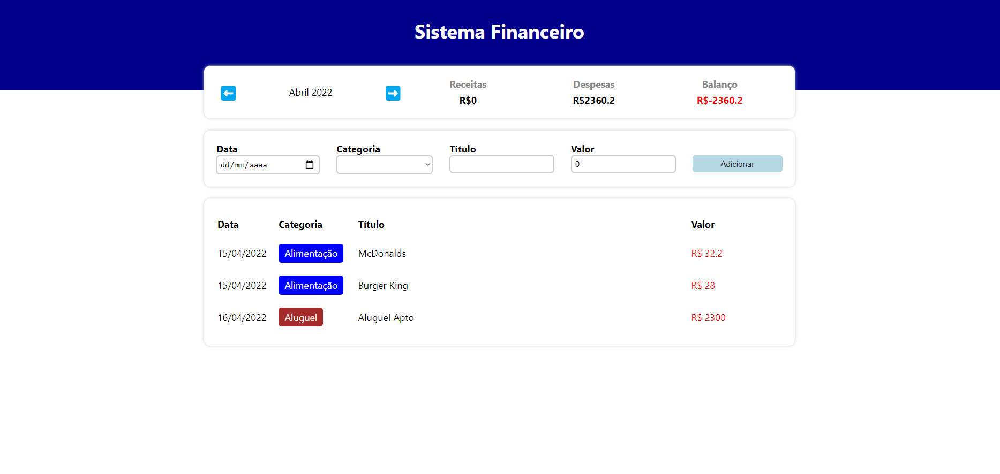
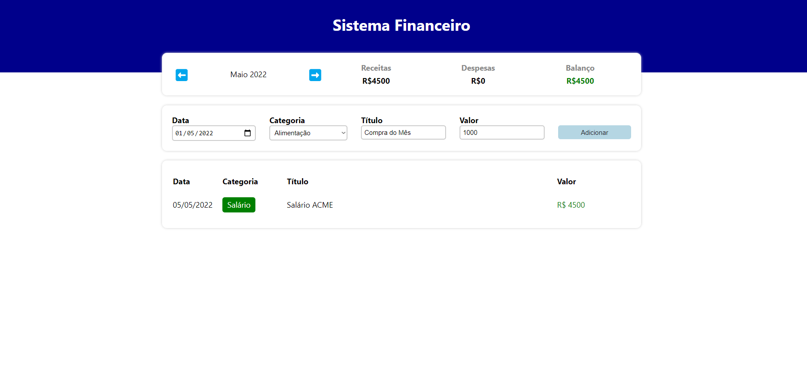

<h1 align="center" >Sistema Financeiro - Controle Mensal</h1>

Aplicação para ter controle das finanças separadas mensalmente, com o título, o valor, a categoria e a data da transação.
<p>Foi feita com Typescript, Styled Components e React.</p>

## Execução do projeto:

Para rodar o projeto, primeiro é necessário clonar o repositório e abrir em uma IDE, VSCode por exemplo.

```bash
# Clonar repositório
$ git clone https://github.com/Edusorrentino10/Sistema-Financeiro.git
# Acessar pasta do projeto clonado
$ cd SistemaFinanceiro

# Instalar dependências
$ npm install

# Executar aplicação
$ npm start

# Abrir aplicação na porta 3000, acessando: http://localhost:3000


__________________________________________________


# Caso dê erro de tipagem, executar em um novo terminal:
$ npm install @types/styled-components
```

<h2 align="center"></h2>
<h2 align="center"></h2>


Feito por <a href="https://github.com/Edusorrentino10">Eduardo Sorrentino</a>.

Linkedin: https://linkedin.com/in/eduardo-sorrentino/